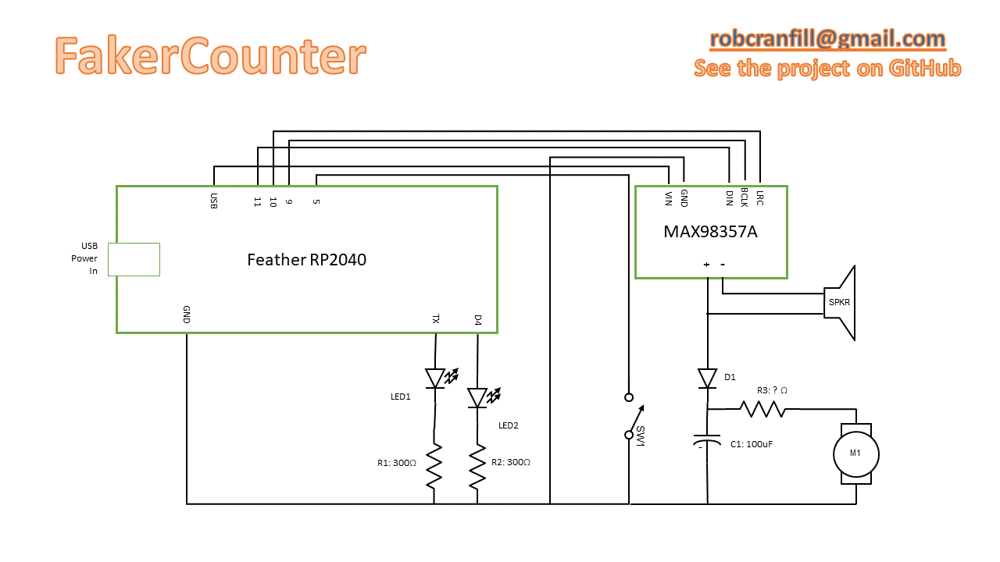
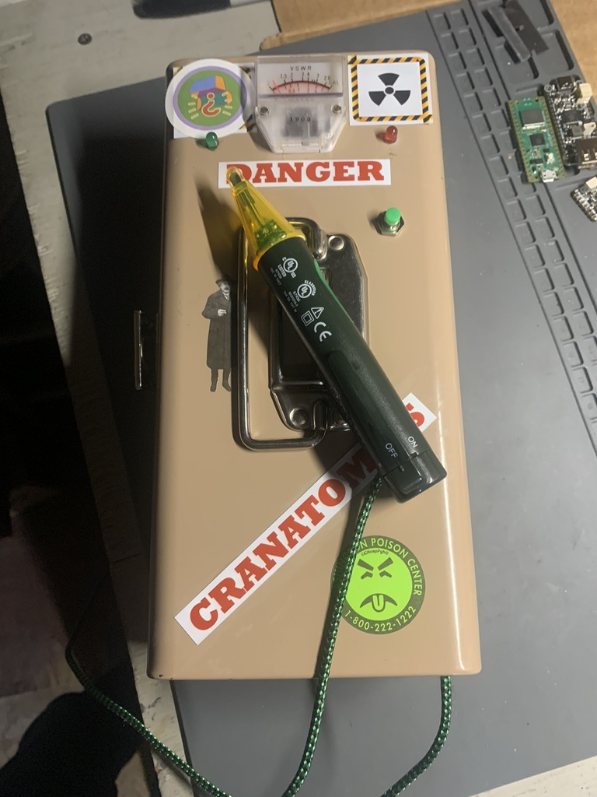
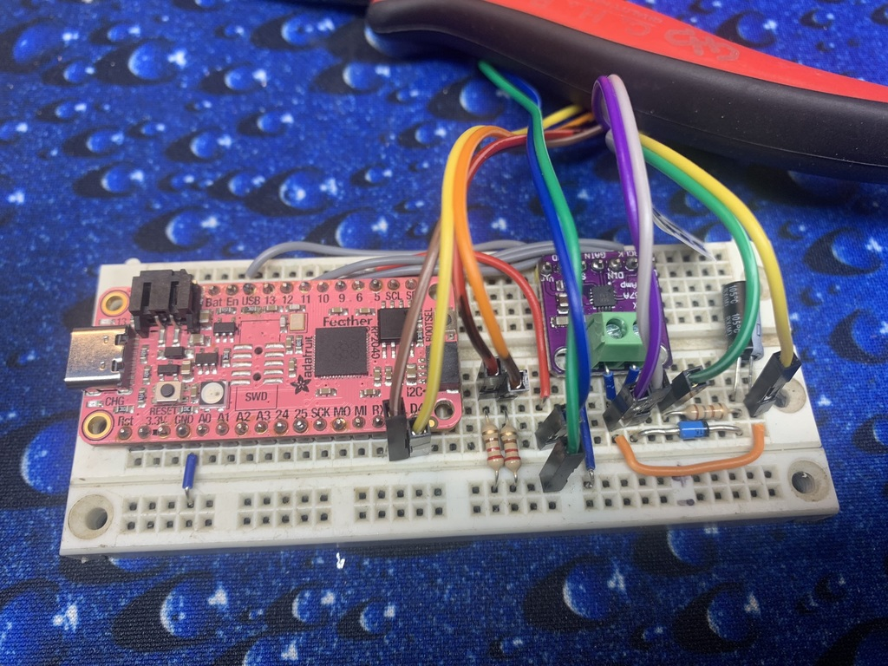
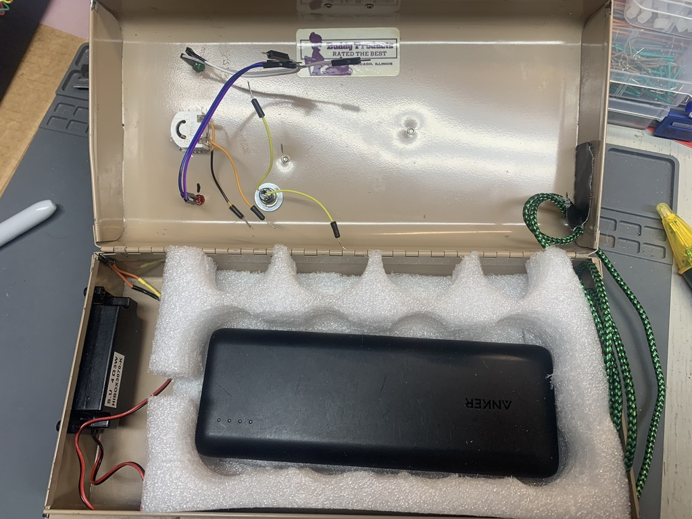
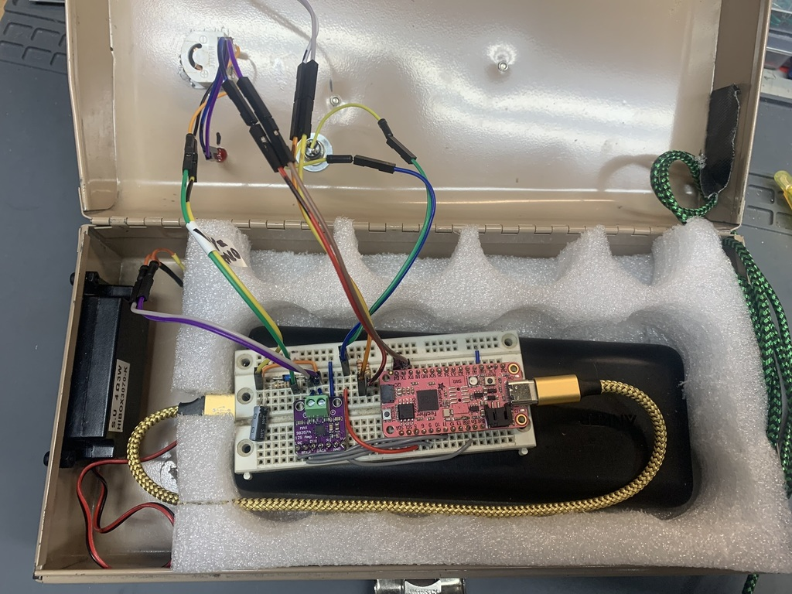
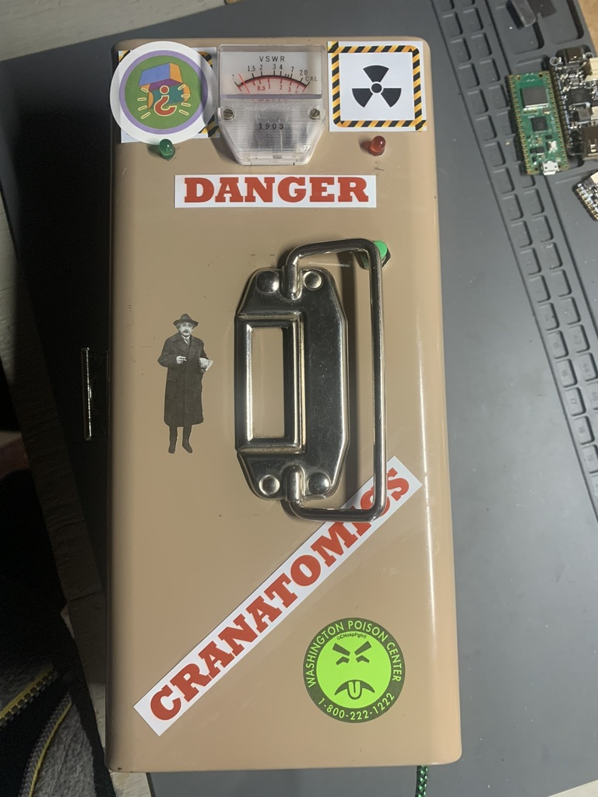
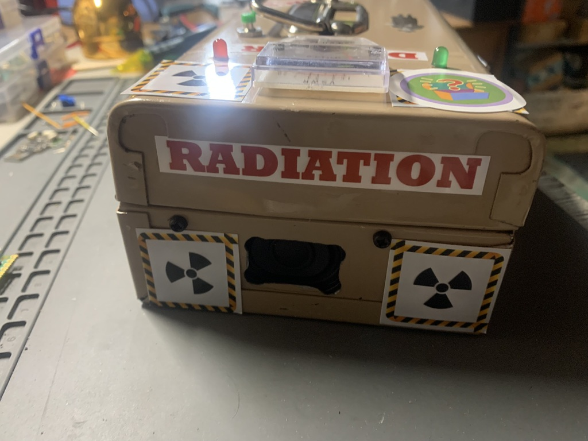
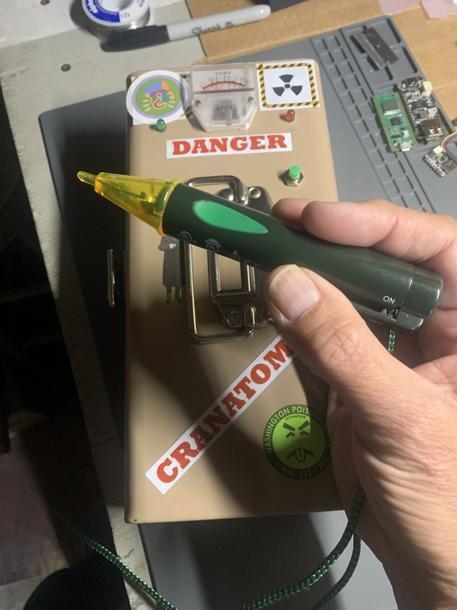

# faker-counter
A prop Geiger counter.

This is a fake Geiger counter I used as part of my Halloween costume in 2023. I went as "Oppenclimber",
a mashup of J. Robert Oppenheimer (suit & tie, fedora, pipe, security badge) and a rock climber (climbing
harness & gear). I also carried this device, which has a speaker that plays actual digitized sounds of a
real Geiger counter at two different levels: a "background" level of a few quiet clicks, and a "high" level
of crazy clicks; the level is controlled by a somewhat inconspicuous button that you push while pointing a 
"sensor wand" that actually does nothing. It also has two LEDs - green and red, for low and high levels -
and a little analog voltmeter whose needle swings in accordance with the clicking.

### Hardware
* CircuitPython microcontroller (needs to support I2S for audio - 3 GPIO pins)
  * The prototype, on a solderless breadboard, used an [Adafruit Feather RP2040](https://www.adafruit.com/product/4884).
  * The second, final, version used a Raspberry Pi Pico.
    * The only downside to the Pico is that the onboard storage was so much less, I had to create downsampled versions of the audio files. Which still sounded fine - you don't need much bandwidth for a bunch of clicking!
* 3 watt I2S audio amp.
  * I used an [Adafruit MAX98357A](https://www.adafruit.com/product/3006)
* Push button to increase click rate.
* Surplus analog voltmeter, 5 volts full scale.
* Green LED for low activity, red LED for high.
* Small speaker.
  * I used an [Adafruit 3W 4 Ohm speaker](https://www.adafruit.com/product/4445)
* 3 resistors, 1 diode, 1 capacitor (see schematic below).
* A box ;I used a second-hand cash box.
* Some kind of speaker grill to hide the hole in the box. I used a piece of open-cell foam.
* USB battery pack.
* Old non-contact electrical sensor as the "sensor".
* A nice braided USB cable as the "sensor" cable.
* Stickers! I also created artwork which I then printed at a local photo kiosk and glued them on.
* [Solderless breadboard](https://www.adafruit.com/product/64) & [leads](https://www.adafruit.com/product/153), or ["perma-proto" board](https://www.adafruit.com/product/1609) & solder.

### Circuit Diagram
 

### Software
CircuitPython (version 8.2.7 used), of course! Plus the code included here. There are no additional Python libraries to install!

# Finished Project
 
 
 
 
 
 
 

# References, Notes
* Thanks to [Paul Price](https://www.eevblog.com/forum/projects/build-an-analogue-vu-meter-with-a-normal-voltmeter/msg872064/#msg872064) for the VU circuit.
 * It's not as loud as I'd like. In my Halloween party setting, it was just loud enough.
 
