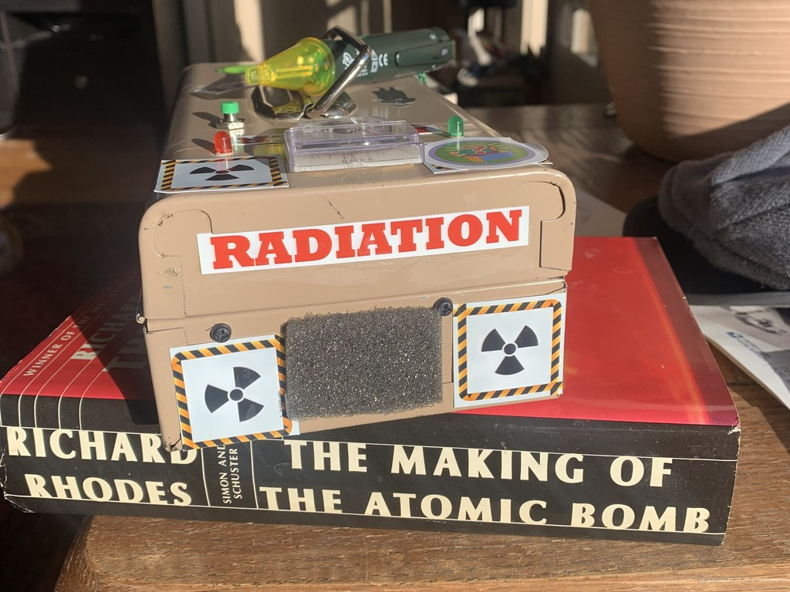

# faker-counter
A fake Geiger counter!

Can I get this done by Halloweeen?

## Things to do

### Functional Hardware
* CircuitPython microcontroller (needs to support I2S for audio - 3 GPIO pins)
  * *was:* <strike>Feather RP2040 (so I can use a LiPo battery)</strike>
* USB battery pack
* Actuator to increase click rate
  * Button? Easiest. Ramp up/down?
  * Slider? Faster response, but harder to do
* Analog meter? yes!
* LED(s)?

### Cosmetic Hardware
* A box
  * Handle? Strap?
* Separate sensor cable
  * A nice braided USB cable (not used for USB)
  * Old non-contact electrical sensor for show

* Display
  * Meter? yes!
    * Fancy LCD display? no.
  * LEDs?
    * Would they draw too much current?
    * No, they are fine
 * Speaker grill to hide ugly hole

### Circuit Diagram

 

### Software
CircuitPython, of course!

# Finished Project

 
 
 
 
 
 
 
